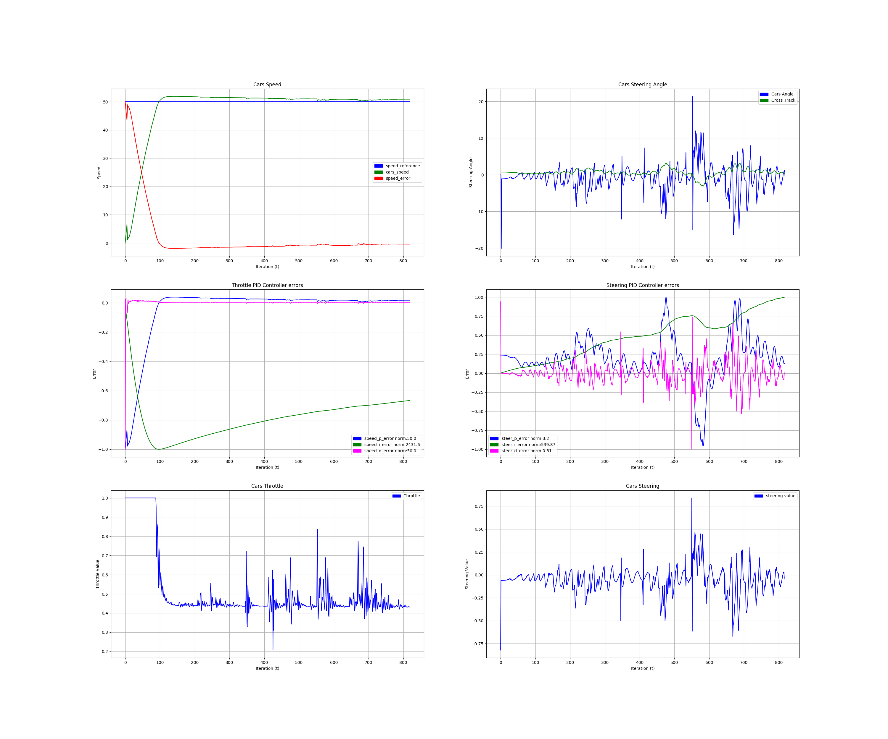

<!-- 
**********************************************************************
https://review.udacity.com/#!/rubrics/1972/view
[Google's C++ style guide](https://google.github.io/styleguide/cppguide.html).

Project Specification
PID Controller

Compilation:
    (OK) - x - Your code should compile.:Code must compile without errors with cmake and make. Given that we've made CMakeLists.txt as general as possible, it's recommend that you do not change it unless you can guarantee that your changes will still compile on any platform.

Implementation:
    (OK) - x - The PID procedure follows what was taught in the lessons: It's encouraged to be creative, particularly around hyper-parameter tuning/optimization. However, the base algorithm should follow what's presented in the lessons.

Reflection:
    (OK) - 1 - Describe the effect each of the P, I, D components had in your implementation: Student describes the effect of the P, I, D component of the PID algorithm in their implementation. Is it what you expected? Visual aids are encouraged, i.e. record of a small video of the car in the simulator and describe what each component is set to.

    (OK) - 2 - Describe how the final hyper-parameters were chosen: Student discusses how they chose the final hyper-parameters (P, I, D coefficients). This could be have been done through manual tuning, twiddle, SGD, or something else, or a combination!

**********************************************************************
Simulation: 
    (OK) - 3 - The vehicle must successfully drive a lap around the track: No tire may leave the drivable portion of the track surface. The car may not pop up onto ledges or roll over any surfaces that would otherwise be considered unsafe (if humans were in the vehicle).

**********************************************************************
-->

# P8-CarND-PID_Controller
[](http://www.udacity.com/drive)

 

## Overview

In this project, I used what I've learned about PID module. I Coded in C++ a Proportional-Integral-Derivative Controller, or PID for short, in order to drive a simulated car around a virtual track. The project involves implementing the controller for car's steering angle but is used also to determine and control the car's throttle value.

---
### **1 - PID Description**:

<!-- Describe the effect each of the P, I, D components had in your implementation. -->

The steering angle is stetted in proportion to what's know as the cross track error, which is the lateral distance between the vehicle and the so called reference trajectory. So I steer the vehicle in proportion to this cross-track error, for car's throttle value a reference.

* The P, or "proportional", component had the most directly observable effect on the car's behavior. It causes the car to steer proportional (and opposite) to the car's distance from the lane center (which is the CTE) - if the car is far to the right it steers hard to the left, if it's slightly to the left it steers slightly to the right.

* The D, or "differential", component counteracts the P component's tendency to ring and overshoot the center line. A properly tuned D parameter will cause the car to approach the center line smoothly without ringing.

* The I, or "integral", component counteracts a bias in the CTE which prevents the P-D controller from reaching the center line. This bias can take several forms, such as a steering drift (as in the Control unit lessons). The I component particularly serves to reduce the CTE.

### **2 - Hyper-Parameters Selection**:

Hyper-parameters were manually tuned. First implemented a PID controller for the car's throttle to follow a speed reference around the track no matter the disturbances. The throttle PID controller is fed with the error (`speed_cte`) between the current speed (`json_speed`) and the reference speed (`desired_speed`). 

I used the next procedure which is a good baseline tune to get a good response to disturbances and tune a PID controller: 

1. Set all gains to zero.
2. Increase the P (`Kp_`) gain until the response to a disturbance is steady oscillation.
3. Increase the D (`Kd_`) gain until the the oscillations go away (Critically damped).
4. Repeat steps 2 and 3 until increasing the D (`Kd_`) gain does not stop the oscillations.
5. Set P (`Kp_`) and D (`Kd_`) to the last stable values.
6. Increase the I (`Ki_`) gain until it brings you to the setpoint with the number of oscillations desired (normally zero but a quicker response can be had if you don't mind a couple oscillations of overshoot)

The disturbance in this case is apply manually a huge steering angle or take off the car from the center of the road. This is moving the mechanism by hand away from the set-point and letting go is enough. 

If the oscillations grow bigger and bigger then you need to reduce the P (`Kp_`) gain. If you set the D (`Kd_`) gain too high the system will begin to chatter (vibrate at a higher frequency than the P gain oscillations). If this happens, reduce the D (`Kd_`) gain until it stops. This method is quite similar to [Ziegler–Nichols method](https://en.wikipedia.org/wiki/Ziegler%E2%80%93Nichols_method).

Sebastian Thrun presented a simple algorithm for tuning PID in his "How to Program a Robotic Car" class. It's called "twiddle", he describes it [here](https://www.youtube.com/watch?v=2uQ2BSzDvXs). Twiddle is very prone to finding local minima--this means that you could come up with a set of three constants that are okay, but not optimal for the situation. The problem of tuning PID constants is a subset of a more general search problem to find certain parameters to maximize utility (in this case, minimizing error of the PID algorithm). You can look into other general solutions to this problem, like hill-climbing, simulated annealing, genetic algorithms, etc. that might end up finding more optimal solutions.

I got the next parameters:

    pid_steering -> Kd_ = 0.08000, Kd_ = 0.00000, Kd_ = 1.00000 
    pid_speed ----> Kd_ = 0.02000, Kd_ = 0.00035, Kd_ = 1.00000

Probabily these PID parameters are not the best solution for this problem, but whit these, I was able to drive safty the car to 50mph without leaving the road. 

  

Steering and Speed Controller at 20mph

  

Steering and Speed Controller at 40mph


  

Steering and Speed Controller at 40mph

### **3 - Results**:

Final results show how the vehicle successfully drive a lap around the track: 
* No tire leave the drivable portion of the track surface. 
* The car not pop up onto ledges or roll over any surfaces that would otherwise be considered unsafe (if humans were in the vehicle)

 


Complete video of PID driving in a complete lap:  

[P8-CarND-PID_Controller_40MPH](https://youtu.be/vjxMtnGiqOM)  
[P8-CarND-PID_Controller_50MPH](https://youtu.be/QHh3DN3BiJw)

---
## Dependencies

* cmake >= 3.5
 * All OSes: [click here for installation instructions](https://cmake.org/install/)
* make >= 4.1(mac, linux), 3.81(Windows)
  * Linux: make is installed by default on most Linux distros
  * Mac: [install Xcode command line tools to get make](https://developer.apple.com/xcode/features/)
  * Windows: [Click here for installation instructions](http://gnuwin32.sourceforge.net/packages/make.htm)
* gcc/g++ >= 5.4
  * Linux: gcc / g++ is installed by default on most Linux distros
  * Mac: same deal as make - [install Xcode command line tools]((https://developer.apple.com/xcode/features/)
  * Windows: recommend using [MinGW](http://www.mingw.org/)
* [uWebSockets](https://github.com/uWebSockets/uWebSockets)
  * Run either `./install-mac.sh` or `./install-ubuntu.sh`.
  * If you install from source, checkout to commit `e94b6e1`, i.e.
    ```
    git clone https://github.com/uWebSockets/uWebSockets 
    cd uWebSockets
    git checkout e94b6e1
    ```
    Some function signatures have changed in v0.14.x. See [this PR](https://github.com/udacity/CarND-MPC-Project/pull/3) for more details.
* Simulator. You can download these from the [project intro page](https://github.com/udacity/self-driving-car-sim/releases) in the classroom.

Students have put together a guide to Windows set-up for the project [here](https://s3-us-west-1.amazonaws.com/udacity-selfdrivingcar/files/Kidnapped_Vehicle_Windows_Setup.pdf) if the environment you have set up for the Sensor Fusion projects does not work for this project. There's also an experimental patch for windows in this [PR](https://github.com/udacity/CarND-PID-Control-Project/pull/3).

---
## Basic Build Instructions

1. Clone [CarND-P8-PID_Controller](https://github.com/JohnBetaCode/CarND-P8-PID_Controller)
2. Make a build directory with: `mkdir build && cd build`
3. Compile: `cmake .. && make`
4. Run it: `./pid`.
5. After this you just can run the script to build and run all: 
    ```
    clear && python3 CarND-P8-PID_Controller.py
    ```

Tips for setting up the environment can be found [here](https://classroom.udacity.com/nanodegrees/nd013/parts/40f38239-66b6-46ec-ae68-03afd8a601c8/modules/0949fca6-b379-42af-a919-ee50aa304e6a/lessons/f758c44c-5e40-4e01-93b5-1a82aa4e044f/concepts/23d376c7-0195-4276-bdf0-e02f1f3c665d)

---
> **Date:** &nbsp; 04/10/2019  
> **Programmer:** &nbsp;John A. Betancourt G.   
> **Mail:** &nbsp;john.betancourt93@gmail.com  
> **Web:** &nbsp; www.linkedin.com/in/jhon-alberto-betancourt-gonzalez-345557129 

 

<!-- Sorry for my English -->